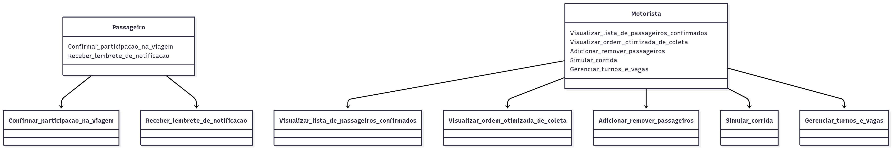
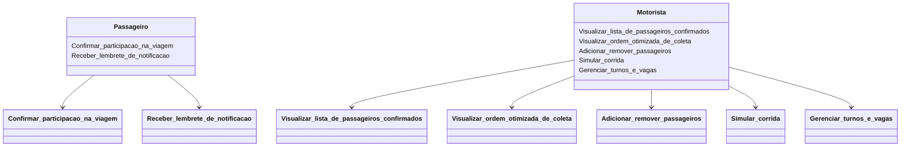

# Diagrama Global de Casos de Uso - Aplicativo Vagas Van

## Grupo 1
| Aluno | Github |
|-------------|-------------|
|Gabriel Freitas dos Reis | GabrielFRails
|Gabriel Rodrigues Silva | Gabriellrs
|Laura Martins Vieira Gonçalves | lauramvg1821
|Léia Santos Costa | Leia27
|Tallya Jesus Sousa Barbosa | tallya01

## Introdução
Este documento apresenta o Diagrama Global de Casos de Uso para o aplicativo "Vagas Van", desenvolvido com base no Documento de Visão fornecido. O diagrama reflete as funcionalidades do MVP (produto mínimo viável) para automatizar a organização de viagens de van, incluindo confirmações de participação, notificações e otimização de rotas, conforme os requisitos levantados.

## Atores
- **Passageiro**: Usuário que utiliza o serviço de van para confirmar participação em turnos e receber lembretes de notificações.
- **Motorista**: Responsável por gerenciar as viagens, visualizar listas de passageiros confirmados, otimizar rotas de coleta e gerenciar grupos de passageiros.

## Casos de Uso
1. **Confirmar_participacao_na_viagem**: Permite ao passageiro avisar o turno e confirmar sua participação na viagem.
2. **Receber_lembrete_de_notificacao**: Envia notificações push programadas ao passageiro para lembrar da confirmação de participação.
3. **Visualizar_lista_de_passageiros_confirmados**: Permite ao motorista ver a lista de passageiros que confirmaram para um turno específico.
4. **Visualizar_ordem_otimizada_de_coleta**: Fornece ao motorista a melhor ordem de coleta dos passageiros para minimizar tempo e distância.
5. **Adicionar_remover_passageiros**: Permite ao motorista adicionar ou remover passageiros de grupos de viagem específicos.
6. **Simular_corrida**: Permite ao motorista simular rotas e prever tempo de percurso com base nos passageiros confirmados.
7. **Gerenciar_turnos_e_vagas**: Permite ao motorista criar e gerenciar grupos de turnos e vagas disponíveis.

## Diagrama de Casos de Uso (Imagem)

## Diagrama de Casos de Uso (Código Mermaid)

